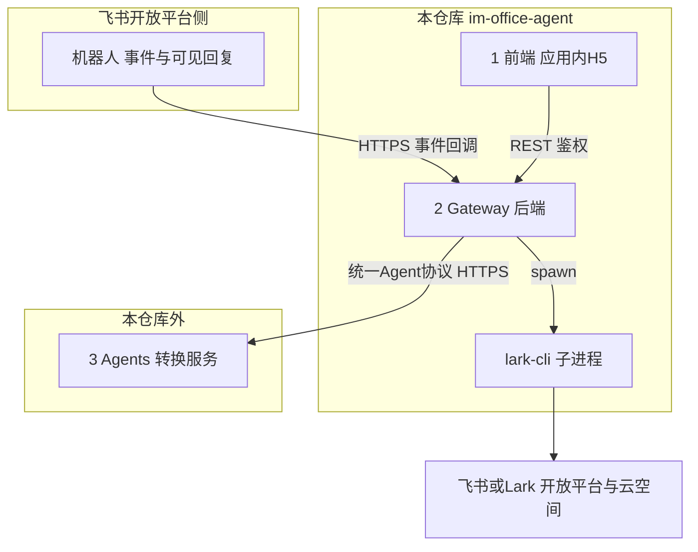
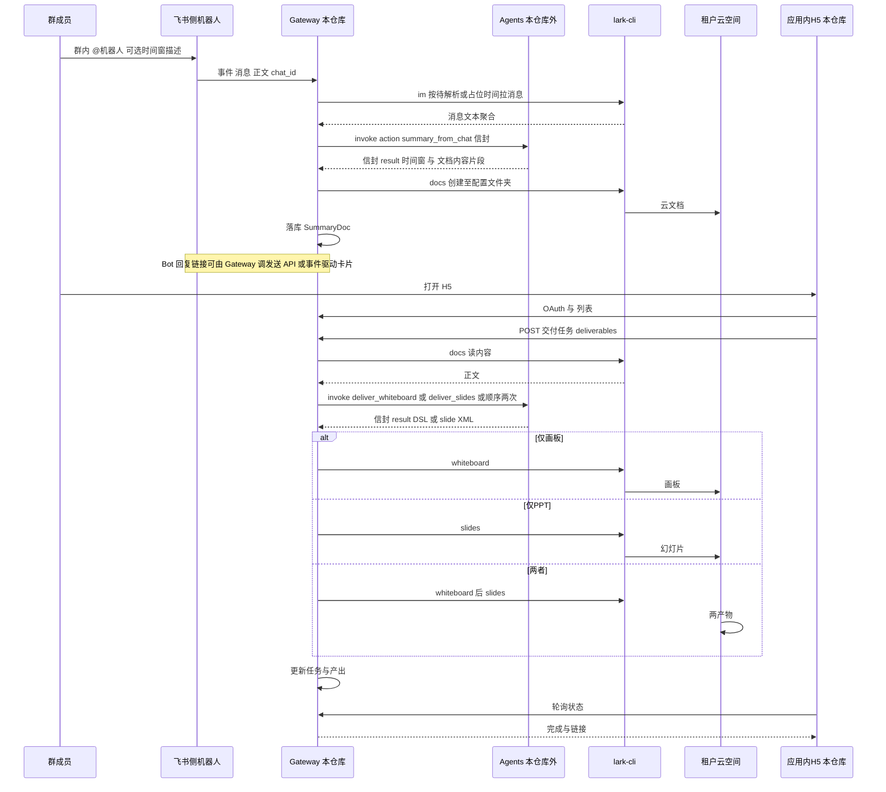

# Agent-Pilot 参赛架构与落地计划

## 背景与约束

- 赛题要求：**Agent 主驾驶、GUI 为辅**；必须覆盖 **IM + 文档**，且 **PPT 或自由画布至少其一**；支持自然语言（文本/语音）；需演示 **移动端 + 桌面端** 双向实时同步，并至少一次 **多场景组合编排**。
- 已选技术锚点：**[larksuite/cli](https://github.com/larksuite/cli)** — **由 Gateway 服务调用**，用于对飞书开放能力统一取数、写盘（`lark-cli im` / `docs` / `whiteboard` / `drive` / `slides` 等）。

### 本仓库范围（**仅 1 与 2**）

| 层 | 职责 | 是否在本 repo |
|----|------|---------------|
| **1. 前端** | 在应用内 H5 中**展现**由聊天触发生成的**原始文档、画板、PPT** 的列表、状态与**打开链接**；交付任务的操作 UI（选来源、画板/PPT/全选、轮询） | **是** |
| **2. 后端（Gateway）** | **统一网关**：与飞书 **Bot 事件**、**前端**、**外部 Agents** 交互；**仅在本层通过 lark-cli** 从飞书拉取聊天记录、创建/更新云文档、白板和幻灯片、写入配置的云空间父目录；OAuth、JSSDK 签名、落库、任务状态 | **是** |
| **3. Agents** | 具体**转换能力**（如 NL 时间窗解析、对话摘要成文、文档→画板 DSL、文档→PPT 的页级 XML/大纲等，通常含 LLM 编排） | **否**（独立服务/其他仓库/团队维护） |
| **（飞书侧）机器人** | **不在本仓库部署**：在开放平台配置；**作用**是接收用户 @ 与群消息、**将事件投递到 Gateway 回调**、在 IM 中回复卡片/文字；**业务语义上**是「**触发**将聊天记录变成文档的整条 Agent 工作流」的第一跳 | 否；仅**配置与回调地址**和本系统对接 |

### 其它已定稿约束

- 产出物落在**当前租户云空间**，**父文件夹**由**部署配置**提供（如 `ARTIFACTS_DRIVE_FOLDER_TOKEN`），不硬编码。
- **飞书 + Lark 双栈**：`Base URL`、应用凭证、Encrypt Key、OAuth、JSSDK 等通过配置区分；`lark-cli` 使用 **profile/环境**。
- **应用内嵌 H5** + JSSDK + 授权码换票；`App Secret` 仅 Gateway 持有。
- @ 机器人可带 **自然语言时间窗**；**未带则默认过去 24 小时**；解析可在 **Agents 层**完成，Gateway 负责传参、拉 `im`、回写与持久化元数据。

---

## 逻辑三层与职责边界

- **数据流（摘要）**：用户 @ 机器人 → **Bot** 把事件给 **Gateway** → Gateway 调 **lark-cli** 拉 `im`、再调 **Agents** 要「时间窗+正文结构」等 → Agents 返回结构化结果 → **Gateway** 用 **lark-cli** 写 `docs` / 后续任务写 `whiteboard`/`slides`、写本地 DB、必要时让 Bot 回复用户 → **前端**通过 Gateway 列表与拉状态。

- **lark-cli 与 Agents 的边界**：
  - **Gateway 独占 lark-cli**：与飞书的一切「读/写云资源、拉消息」都经 Gateway，避免 Agents 直持租户凭证的分散风险。
  - **Agents 不调用 lark-cli**：接收「已脱敏/已裁剪的输入」（如时间窗、拼接后的群聊文本、doc 纯文本/大纲）与任务类型，返回「待写入的片段」（如 doc XML、白 DSL、slides XML 片段）；**真正写入**由 Gateway 用 CLI 或官方 API 执行（与现有计划一致）。

---

## 与相关方对接方式（需文档化、评审一次）

| 相关方 | 对接边界 | 载体/约定 |
|--------|----------|------------|
| **飞书开放平台** | 事件回调、发消息/卡片、OAuth、JSSDK 签名、scope | 官方文档 + 本仓 **《Gateway-飞书对接》**：URL 白名单、Encrypt 解密、idempotent 事件、重试与失败告警 |
| **1 前端** | 仅与 Gateway 通信 | **《Gateway-BFF API》** OpenAPI：`/api/v1/...`、Cookie/JWT 会话、错误体格式、WebSocket/SSE/轮询若启用则单列 |
| **3 Agents 全体** | 仅与 Gateway 通信、**不直连前端与飞书** | **下节「统一 Agents 交互协议」**；**禁止** 为每个场景单独造一套非兼容协议 |

> 每类对接在 `docs/integrations/`（或 `specs/`）下**各一份 Markdown + 对应 OpenAPI/YAML**，PR 中变更需同步更新；对外评审时以这三份为附件。

---

## 统一 Agents 交互协议（单一协议，可演进）

**目标**：与**所有**外部 Agent/Agent 集群的交互，经 **Gateway 的同一套 Client**，使用 **一个协议族**；新增「摘要 / 画板 / PPT / 以后 whatever」**只增 `action` 与 `payload` 字段，不改传输形态**，避免多协议并存的对接成本。

### 建议形态

- **传输**：HTTPS **JSON**（MVP 足够）；**单 Base URL**（`AGENTS_BASE_URL`）+ 路径如 **`POST /v1/agent/invoke`**，或 **`POST /v1/invoke` 单端点**（二选一在首版 spec 中写死，后续不变轨只升版本号）。
- **统一信封（Envelope）— 请求**（字段名可微调，**语义**需保留）：

  - `protocol_version`：如 `1`，不兼容时升主版本。  
  - `request_id` / `idempotency_key`：便于排障与去重。  
  - `trace_id`：与 Gateway 日志、飞书 `challenge`/事件 id 可关联。  
  - `action`：**唯一区分业务**的字符串枚举（**扩展点**）例如：  
    `summary_from_chat` | `deliver_whiteboard` | `deliver_slides` | 将来 `...`  
  - `context`：公共上下文字段（`tenant_id`、`locale`、`user_open_id` 等**非密钥**、以及 `task_ref` 引用 Gateway 已落库 id）。  
  - `payload`：该 `action` 的**专用 JSON**（**允许向后兼容地加 key**）。

- **统一信封 — 响应**：

  - `protocol_version`  
  - `request_id`  
  - `ok` 或 分层：`error` 对象（`code` 机器可读、`message` 人类可读、`details` 可选）  
  - `result`：`payload` 形状随 `action` 定义（如 `summary_from_chat` 含 `time_window` + `doc_content_xml` 等；**在 OpenAPI components 中按 action 分 schema**）。

- **非功能**：`Authorization: Bearer <AGENTS_M2M_TOKEN>`、超时（可配置，如 30s/120s 分 action）、**429/503 退避**、请求体大小上限、PII/密钥**禁止**在 payload 中回传。

- **演进规则**：  
  - 同一 `protocol_version` 下 **只加可选字段、不改语义**；破坏性变更则 **`protocol_version` 或 path `/v2`** 新文档。  
  - 新能力 = **新 `action` + 新 `payload`/`result` schema**，不新开一套 HTTP/二进制协议。

- **本仓库落物**：`specs/agents-protocol/openapi.yaml` + `docs/agents-protocol.md` 说明与示例；`gateway` 内 **一个** `AgentsClient.invoke(envelope) -> Envelope`；Mock Agents 实现**同一** OpenAPI。

### 与旧表述的对应

- 原先分散的 `POST /v1/summary-from-chat`、`/v1/deliver` **合并为上述单协议多 `action`**（或保留多 path 但**共享同一套 envelope schema**，二者选其一、写进 spec 后即冻结 MVP）。

---

## 业务流程与序列图（与三层对齐）

以下为参赛 MVP 主链路；**LLM/规划** 落在 **Agents**；**拉消息、落文档、回 IM** 在 **Gateway**。

> 上图中 **Orch+LLM** 已拆为 **Gateway + Agents**；若某步「时间窗解析」为降低延迟放在 Gateway 内，仍建议**与 Agents 的提示词版本对齐**，并文档化，避免与「Agents 管转换」混淆。

| 步骤 | 说明 |
|------|------|
| **1. 群聊 @ 机器人** | 飞书侧 **Bot** 将事件推至 **Gateway**；Gateway 用 **lark-cli** 拉 `im`；**Agents** 产出总结与时间窗结果；**Gateway** 用 **lark-cli** 写**云文档**并落库；**Bot** 在群内回复链接。 |
| **2–4. H5 列表、交付、产出** | 仅与 **Gateway** 通信；Gateway 从飞书/库组装列表；用户发起交付时 Gateway **拉 doc → 调 Agents → 用 CLI 写** 画板/PPT；与先前「`deliverables`、alt 三态」一致。 |

### 时间窗与默认（不变）

- **未写时间窗**：`[t0-24h, t0]`；**写了**：优先由 **Agents** 输出结构化起止，Gateway 做边界校验（最大跨度、条数）后再调 `im`。

---

## 模块表（与三层对齐）

| 模块 | 职责 |
|------|------|
| **飞书侧机器人** | 配置在开放平台，**不部署于本 repo**；触发「聊天→文档」；事件进 Gateway。 |
| **1 前端** | 展现文档/画板/PPT 与元数据、发起交付、轮询；**不直连** Agents 或 lark-cli。 |
| **2 Gateway** | **唯一**使用 `lark-cli` 的进程；接 Bot 事件、接 OAuth、**调用 Agents**、写 DB、向前端提供 REST。 |
| **3 Agents** | 转换与 LLM 编排；**不本仓实现**；须实现 **统一 Agents 交互协议**（OpenAPI + `action`/`payload` 扩展），由 Gateway 唯一调用。 |

**赛题覆盖说明**：**IM、文档、画板或 PPT** 由飞书+Gateway+CLI+Agents 共同完成；**GUI** 为前端。

---

## lark-cli 与 Gateway（调研结论摘要）

- **无内置「总结对话」命令**；`im` 可拉取消息。总结由 **Agents** 做。
- **docs / whiteboard / slides** 的创建与更新由 Gateway 调 CLI 完成（与父目录**配置**一致）。

---

### 配置项（部署层）

| 配置键（示例） | 含义 |
|----------------|------|
| `ARTIFACTS_DRIVE_FOLDER_TOKEN` 等 | 云空间父目录 |
| `LARK_PRODUCT`、App ID/Secret、回调与 OAuth | 双栈 |
| `AGENTS_BASE_URL`、token | 外部 Agents **单 Base** + M2M 鉴权（见统一协议） |
| `PUBLIC_WEB_BASE_URL` | 应用内网页根 URL |

---

## 阶段一（本 repo）：在统一协议上落地

- 实现 **一个** `AgentsClient` 与 `specs/agents-protocol/openapi.yaml` 对齐；首版 `action` 至少覆盖 `summary_from_chat`、`deliver_whiteboard`、`deliver_slides`。
- Gateway：同步/异步策略（如交付任务可 **202+轮询**）、幂等与 **错误码 → 前端/ Bot 文案** 映射表（写在 `docs/`）。
- **不** 为单场景再开私自 RPC；需求变更 = **新 action 或 payload 扩字段** + 版本说明。

## 阶段二：工程与赛题

- 多端、OAuth、JSSDK、飞书与 Lark 控制台配置等 **均在 Gateway + 前端** 落地；与上一版一致，唯「编排服务」**仅指 Gateway**。

## 本仓库目录建议

- `apps/web` — 前端，应用内 H5。
- `services/gateway`（或 `server/`）— **唯一后端**：事件、CLI、DB、**`AgentsClient`（统一协议）**、对前端的 API。
- `specs/agents-protocol/` — **OpenAPI + 各 action 的 result/payload 组件 schema**；评审源。
- `docs/integrations/` — 飞书、前端、Agents 三份对接说明（可与 specs 互链）。
- `packages/lark-cli-driver` — CLI 调用封装、配置注入、日志脱敏。
- **不** 包含 `services/agent-*`；Mock/联调 = 符合同一 OpenAPI 的轻量服务。

---

## 风险与缓解

| 风险 | 缓解 |
|------|------|
| Gateway 与 Agents 协议漂移 | **单一** openapi + Contract 测试；`protocol_version` 不兼容时显式升版 |
| 相关方各写各的接口 | 强制三份 `docs/integrations` + **唯一** `agents-protocol` 评审入口 |
| Agents 超时导致用户空等 | 异步任务 + 前端轮询、Bot 长耗时可先发「处理中」 |
| 群消息量过大 | Gateway 侧时间窗+条数上限后再交给 Agents |
| 应用内 WebView 与 OAuth | 同前；`redirect_uri` 指向 Gateway 公开域名 |

---

## 建议时间线（本 repo）

1. **Week 1**：冻结 **`specs/agents-protocol` v0** + Mock；Gateway 接飞书事件 + lark-cli 拉 im + `invoke(summary_from_chat)` 通「@→落文档」；父目录与 Bot 回链。
2. **Week 2**：前端 H5 + Gateway OAuth/DB + **真 Agents 按同协议**联调。
3. **Week 3**：`deliver_*` 三态 + 双端演示；协议有变更则**升 `protocol_version` 或记 changelog**。
