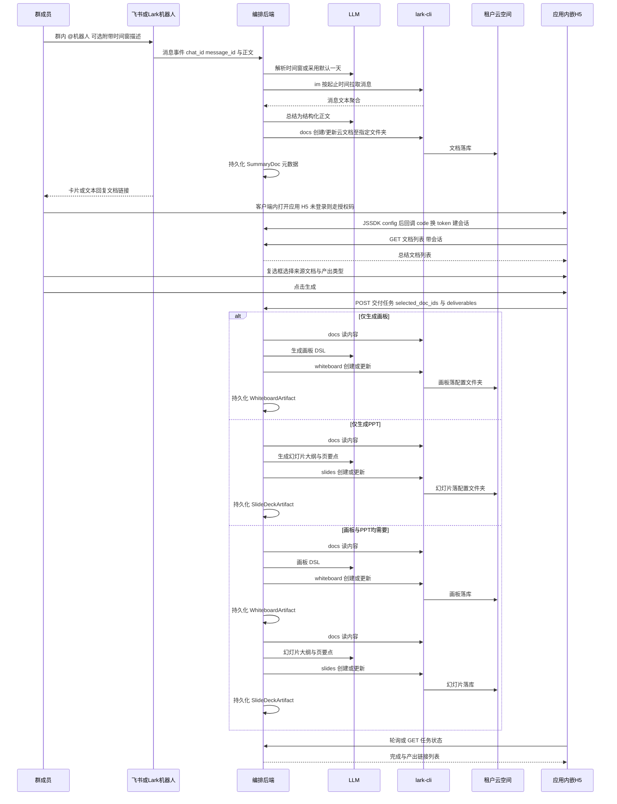
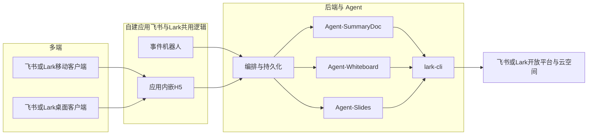

# Agent-Pilot 参赛架构与落地计划

## 背景与约束

- 赛题要求：**Agent 主驾驶、GUI 为辅**；必须覆盖 **IM + 文档**，且 **PPT 或自由画布至少其一**；支持自然语言（文本/语音）；需演示 **移动端 + 桌面端** 双向实时同步，并至少一次 **多场景组合编排**。
- 当前仓库 [`im-office-agent`](file:///Users/yangkefan/Documents/projects/im-office-agent) 几乎为空（仅 `.git`），可按模块从零搭建。
- 已选技术锚点：**[larksuite/cli](https://github.com/larksuite/cli)** 作为对飞书开放能力的统一执行面（`lark-cli im` / `docs` / `whiteboard` / `drive` 等）。
- **已定稿业务约束（本次迭代）**：
  - **所有生成产出物**（总结文档、画板等）均落在**当前租户云空间**下；**具体父文件夹**（`folder_token` 或等价标识）**不由代码写死**，而由**部署配置**提供（环境变量或配置文件，如 `ARTIFACTS_DRIVE_FOLDER_TOKEN`），便于多环境与多租户迁移。
  - **飞书 + Lark 双栈**：同一套业务代码需可通过配置切换 **国内飞书** 与 **Lark 国际版**（开放平台 **Base URL**、**应用凭证**、事件订阅 **Encrypt Key**、OAuth 授权页域名、**JSSDK** 脚本地址等）；`lark-cli` 侧与官方一致使用 **profile/环境** 区分（参见 [larksuite/cli](https://github.com/larksuite/cli) 与 `lark-cli config` 文档）。
  - **Web 形态**：采用开放平台 **「应用内网页 / 网页应用」** 能力——在飞书或 Lark **客户端内 WebView** 打开（工作台应用主页、机器人菜单入口等配置的 H5 URL），而非仅独立浏览器站点；集成对应产品线 **JSSDK**（如 `@lark-op/embedded-app-sdk` / 飞书侧等价包，以当前官方文档为准）完成 **config**、**鉴权上下文**；用户会话仍通过 **OAuth 2.0 授权码**（在应用内 WebView 内完成跳转与 `redirect_uri` 回调）换票，服务端存 token，API **必须带登录态**。
  - **Web 前端尽量简单**（列表 + 复选框 + 按钮 + 产出区即可，避免重型 SPA）。
  - **@ 机器人时可附带自然语言时间窗**（如「半小时以内」「今天上午」）；Agent 理解并换算为绝对起止时间再拉消息；**未指明时间窗时默认总结「过去一天」**（以触发消息时间戳为锚：**过去 24 小时**内的群消息，实现简单、演示口径清晰）。

---

## 业务流程（已定稿）

以下为参赛 MVP 的主链路，对应赛题中 IM → 文档 → **画板与/或 PPT** 的交付编排（由用户在 Web 上 **二选一或全选**）。

| 步骤 | 说明 |
|------|------|
| **1. 群聊 @ 机器人** | 在群聊中 @ 机器人即触发一次「总结任务」。用户可在同一条消息里用**自然语言描述希望总结的时间范围**（例如「半小时以内」「今天上午」「从昨天下午到现在」）；编排层先将其**解析为绝对时间区间**（见下），再按区间用 `im` 拉取该群消息并交给 LLM 生成**云文档**。若用户**未给出任何时间窗描述**，则**默认**总结 **过去 24 小时**内该群消息（与「一天」口径对齐，便于实现与验收）。 |
| **2. Web 查看总结文档列表** | 用户在 **飞书或 Lark 客户端** 内通过 **工作台应用 / 机器人菜单** 打开已配置的 **应用内网页（H5）**；前端加载对应产品线 **JSSDK** 并完成 **授权码登录**（WebView 内跳转授权页 → `redirect_uri` 带 `code` → 后端换票）。登录后请求后端列出**当前用户可见范围内**的总结文档（标题、时间、链接、可选 chat）；元数据与 `document_id` 一致；可见性规则实现阶段按 `open_id`/群成员关系定。 |
| **3. 选择来源与产出类型并触发生成** | Web 提供**复选框**勾选一个或多个总结文档作为素材；另用**互斥可组合选项**（如两个勾选框「生成画板」「生成 PPT」，允许 **只选其一** 或 **两项都选**；若均未选则前端校验提示）。单一按钮（如「**开始生成**」）提交异步 **交付任务**，请求体携带 `selected_doc_ids` 与 `deliverables: { whiteboard?, slides? }`。 |
| **4. 查看产出物** | 任务完成后，在「产出物」区列出本次生成的 **画板链接** 与/或 **幻灯片链接**（类型、名称、时间）；与编排库及飞书侧 artifact 一致。 |

### 时间窗策略（自然语言 + 默认一天）

1. **输入**：触发消息的**纯文本**（去掉 @ segment 后剩余文案）+ **消息服务器时间** `t0`（或飞书消息时间戳）+ **租户时区**（配置为如 `Asia/Shanghai`，用于「今天上午」「昨天」等表达）。
2. **理解方式（推荐）**：**轻量 LLM 结构化输出**（JSON：`window_start_unix`, `window_end_unix`, `rationale`），system prompt 固定规则：**`window_end` 默认等于 `t0`**；仅当用户语义明确要求「到某时刻为止」时再改结束时间。对模糊表达给出保守窄窗（如「刚才」→ 最近 15～30 分钟可在 prompt 中定义）。
3. **用户显式时间窗**：若模型判断用户给出了可解析的时间范围，则使用该区间与 `im` 拉消息 API 对齐（注意 API 能力与分页上限）。
4. **默认（未给出时间窗）**：**`[t0 - 24h, t0]`** 作为拉取区间。
5. **安全边界**：无论解析结果如何，对拉取区间设置**最大跨度上限**（如 7 天）与**单群最大条数**上限，防止误解析导致全量历史扫描。
6. **可观测性**：机器人回复或卡片中附带一行**实际采用的时间窗**（人类可读），便于用户纠错与评委验收。

---

## 总体架构（四模块，与业务流程对齐）

| 模块 | 职责 |
|------|------|
| **机器人（飞书/Lark）** | 监听群消息；识别 **@机器人**；解析同条消息中的 **NL 时间窗**；触发总结流水线；回复文档链接并**回显实际时间范围**；事件与验签随产品线切换配置。 |
| **应用内嵌 H5** | **JSSDK** + **授权码换票**；**文档列表**；来源 **多选**；**产出类型**：画板 / PPT **二选一或全选**（两枚勾选框）；**开始生成**；**产出物列表**（客户端内打开链接）。短轮询即可。 |
| **Agent-SummaryDoc** | **时间窗解析**（NL→区间，含默认一天）→ 消息聚合 + **LLM 总结正文** + `lark-cli` 创建云文档到 **配置指定的云空间父文件夹**。 |
| **Agent-Whiteboard** | 在 `deliverables` 含画板时执行：读文档 + LLM 生成 DSL + `lark-cli whiteboard`；父目录见配置（可与文档同 token 或 `ARTIFACTS_WHITEBOARD_FOLDER_TOKEN`）。 |
| **Agent-Slides** | 在 `deliverables` 含 PPT 时执行：读文档 + LLM 生成页级结构 + `lark-cli slides`；父目录见配置（可与文档同 token 或 `ARTIFACTS_SLIDES_FOLDER_TOKEN`）。 |
| **编排服务** | 事件回调、OAuth、**DeliveryJob**（含 `deliverables` 与子步骤状态）；**SummaryDoc** / **WhiteboardArtifact** / **SlideDeckArtifact** 持久化；鉴权 REST；可选 SSE/WebSocket。 |

**赛题覆盖说明**：主链路覆盖 **IM + 文档**；演示侧通过交付选项同时满足 **自由画布与/或演示文稿（PPT）**——至少演示一种，**推荐编排一条「两者全选」**以体现组合能力。

**lark-cli**：子进程封装、`--format json`；**云空间落点**：创建文档、画板、幻灯片时传入 **配置中的 `folder_token`**（或 CLI 支持的 parent 参数）；不硬编码 ID。**双栈**：**config profile** 或环境变量区分飞书与 Lark。

### 配置项（部署层，建议文档化）

| 配置键（示例） | 含义 |
|----------------|------|
| `ARTIFACTS_DRIVE_FOLDER_TOKEN` | 文档/画板/幻灯片等产出物的 **默认父文件夹**；必填 |
| `ARTIFACTS_WHITEBOARD_FOLDER_TOKEN` / `ARTIFACTS_SLIDES_FOLDER_TOKEN` | 可选：画板与幻灯片分目录时使用 |
| `LARK_PRODUCT` / `FEISHU_APP_ID` 等 | 区分 **feishu** / **lark** 与对应 App 凭证、回调 URL、Encrypt Key |
| `OAUTH_REDIRECT_URI` | 授权码回调地址（需同时出现在开放平台「重定向 URL」与 **应用内网页** 可访问路径） |
| `PUBLIC_WEB_BASE_URL` | H5 对外根地址（飞书/Lark 应用内网页配置处填写） |

---

## 阶段一：Agent 与工具链（略调，对齐新业务）

### 1.1 群聊时段消息 → 云文档（Agent-SummaryDoc）

- **输入**：`chat_id`、触发消息文本（用于 NL 时间窗）、`t0`、时区配置；随后为**解析后的** `[start, end]` 区间内消息列表（`im` 拉取）。
- **输出**：云文档 `document_id`、标题、父文件夹、`open_url`（飞书或 Lark 域名）；元数据持久化 `resolved_window_start/end` 与可选 `user_time_hint_raw`。
- **框架**：LangGraph 或轻量 ReAct 均可；至少两个逻辑阶段：**(A) 时间解析**（独立短 prompt + JSON schema）**(B) 总结成文**（会议纪要/讨论结构化）；**(B)** 与 **交付类 Agent（画板 / 幻灯片）** 解耦。

### 1.2 所选文档 → 画板（Agent-Whiteboard）

- **输入**：一个或多个总结文档标识；仅当任务 `deliverables.whiteboard === true` 时进入本路径。
- **输出**：画板在云空间的链接；元数据入库。
- **实现**：`lark-cli docs` 读正文；LLM → whiteboard DSL（参见 [lark-whiteboard](https://github.com/larksuite/cli)）；`lark-cli whiteboard` 写入。

### 1.3 所选文档 → 幻灯片（Agent-Slides）

- **输入**：同上；仅当 `deliverables.slides === true` 时进入。
- **输出**：Slides 在云空间的链接；元数据入库。
- **实现**：`lark-cli docs` 读正文；LLM 输出严格结构的页列表；`lark-cli slides` 创建或追加幻灯片（参见 [lark-slides](https://github.com/larksuite/cli)）。

**两者全选时**：编排层可 **顺序执行**（先画板后幻灯片或反之），失败则子步骤独立重试/回滚策略在实现时定；序列图中 **alt 第三分支** 描述该串联。

### 1.4 调研收口

- 固定 **NL 时间窗 prompt**、**默认 24h** 与 **最大跨度/条数** 常量；版本号写入配置。
- 脚本用例：`im` 时间窗两条；另加 **交付任务** `deliverables` 三种组合（仅画板、仅 slides、两者）校验落库与链接。

---

## 阶段二：工程与赛题对齐要点

### 2.1 多端同步（Must-have）

- **MVP 极简做法**：**飞书/Lark 手机客户端与桌面客户端** 分别从工作台打开同一 **应用内嵌 H5** URL；使用**同一套 REST + 轮询任务状态**演示「双端列表与任务状态一致」。若时间有余，再加 WebSocket 推送列表刷新。
- **真源**：业务元数据在编排库；**文档、画板、幻灯片正文真源**在租户云空间（**父目录由部署配置指定**）。

### 2.2 自然语言

- **主路径**：**@ 行内自然语言**用于**控制总结时间范围**（赛题「自然语言驱动」的显式落点）；群内历史讨论正文仍进入总结模型输入。
- **@** 为明确触发信号；未写时间窗则走 **默认过去 24 小时**。
- **可选增强**：「补充说明」文本框随 **开始生成** 一并提交，供画板与幻灯片两路 prompt 共用（仍保持页面简单）。

### 2.3 飞书与 Lark 开放平台配置

- **应用内网页**：在 **飞书开放平台** 与 **Lark 开放平台** 各自创建/配置自建应用（或同一品牌两套应用）；在「**网页应用 / 应用主页**」填写 **H5 根 URL**（与 `PUBLIC_WEB_BASE_URL` 一致），保证 **桌面端与移动端** 均在客户端 WebView 内可访问。
- **OAuth**：两套环境分别配置 **重定向 URL**（`redirect_uri`）、**App ID / App Secret**；授权页域名随 **feishu / lark** 切换；编排服务根据请求 Host 或前端上报的 `product` 选择对应 **换票 endpoint**（**禁止**在前端暴露 Secret）。
- **JSSDK**：H5 按产品线加载对应 **JSSDK 脚本**并完成 `config`（`appId`、`timestamp`、`signature` 等由后端签发）；处理 **iOS/Android 与 PC WebView** 差异（官方文档中的 UA、调试方式）。
- **事件订阅**：`im.message.receive_v1`（或等价）；**Encrypt Key**、**Verification Token** 两套应用分别配置；回调 URL 可同一路由通过配置区分验签密钥。
- **权限**：`im`、云文档、云空间（drive）、**画板**、**slides（幻灯片）** 等与 `lark-cli` 能力对齐的 **scope 并集**；**Web 用户态**与 **CLI 执行态** token 分区存储。
- **身份**：写文档、画板、幻灯片与 **配置文件夹** 的写入权限一致（user 或 bot 二选一并文档化）；双栈下分别在两个开放平台检查 **云空间与 slides scope**。

### 2.4 演示脚本（与已定流程一致）

1. 群内 **@ 机器人**（含/不含时间窗各一次）→ 回复含**实际时间窗**；云文档落在 **配置指定** 的云空间文件夹。
2. **手机与桌面客户端** 从工作台进入 **应用内嵌 H5** → **授权码登录** → 列表一致（可各选飞书或 Lark 一条链路演示，或两条都备）。
3. **勾选** 文档后分别演示：**仅画板**、**仅 PPT**、**两者全选** → **产出物** 区链接正确。
4. 强调 **lark-cli** 域：**im**、**docs**、**whiteboard**、**slides**（按演示勾选实际调用）。

---

## 仓库与部署建议（实现阶段）

- `services/orchestrator` — 飞书/Lark 回调、DB、文档列表 API、**交付任务** API（解析 `deliverables`）、JSSDK 签名接口。
- `services/agent-summary` — 消息→文档（可内嵌于 orchestrator 小团队时）。
- `services/agent-whiteboard` / `services/agent-slides` — 文档→画板 / 文档→幻灯片（或同包内两模块）。
- `apps/web` — 极简 H5：**JSSDK 接入** + **`/oauth/callback`** 接收 `code`；构建产物静态托管，URL 填入开放平台「应用内网页」。
- `packages/lark-cli-driver` — CLI 调用、超时、脱敏；**父文件夹 token 从配置注入**（不写死仓库）。
- `config/` 或 `.env.example` — 文档化 **飞书/Lark** 与 **`ARTIFACTS_DRIVE_FOLDER_TOKEN`** 等变量。

---

## 风险与缓解

| 风险 | 缓解 |
|------|------|
| 群消息量过大 | 时间窗 + 条数上限 + 截断策略 |
| NL 时间解析歧义/幻觉 | JSON schema 校验 + 最大跨度夹逼 + 回复中回显区间便于人工发现 |
| 画板 DSL 或 Slides 结构复杂 | MVP 模板化页数与节点数；两者全选时明确顺序与失败子状态 |
| 权限导致文档不在目标文件夹 | **配置项**使用管理员预建文件夹并授权应用/用户；双栈分别在两端控制台核对 drive scope |
| 应用内 WebView 与 OAuth 兼容 | 严格按官方「应用内网页 + 授权」文档；`redirect_uri` 与 JSSDK 安全域名一致 |

---

## 建议时间线

1. **Week 1**：任选一条产品线跑通应用 + **配置文件夹** + @ 触发 + 首篇文档 + 机器人回链；再复制配置接第二条产品线。
2. **Week 2**：DB + 双栈 OAuth + JSSDK 签发接口 + 应用内嵌 H5（登录 + 列表）。
3. **Week 3**：交付任务（画板与或 PPT）+ `deliverables` 三态验收 + 双端演示；可选 WS 加分项。
