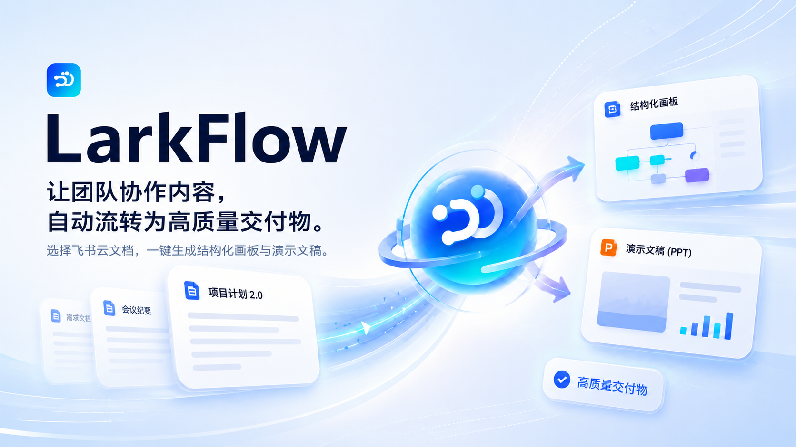

# IM Office Agent

<p align="center">
  
</p>

<p align="center">
  <strong>把飞书群聊里的讨论，整理成可交付的文档、画板和演示材料。</strong>
</p>

<p align="center">
  
  
  
  
</p>

<p align="center">
  <a href="#核心能力">核心能力</a> ·
  <a href="#架构设计">架构设计</a> ·
  <a href="#快速开始">快速开始</a> ·
  <a href="#项目现状">项目现状</a>
</p>

---

## 项目简介

IM Office Agent 是一个面向飞书 IM 场景的办公协同智能助手原型。它尝试解决一个很常见的问题：很多项目决策、任务分工和临时方案都发生在群聊里，但真正沉淀成文档、流程图或汇报材料时，往往还需要人工重新整理。

本项目的思路是：让用户在飞书群聊中 `@机器人` 触发总结，Gateway 拉取指定时间窗内的群消息，Agent 将聊天内容整理成平台无关的结构化 IR，再由 Adapter 发布为飞书文档、画板或 PPTX 等办公产物。

这不是一个完整商业化产品，而是飞书 AI 校园大赛期间完成的可运行 MVP。我们尽量把核心链路打通，把可复用的协议、IR、Adapter 和飞书集成代码开源出来，方便后续继续扩展。

## Demo 视频

> 视频占位：后续可在这里放置项目演示视频链接、GitHub 上传视频，或使用封面图跳转到录屏地址。

## 核心能力

- **群聊到文档**：在飞书群里发送 `/summary`，根据最近一段聊天生成忠实纪要、行动项、待确认事项和来源摘录。
- **统一中间表示 IR**：Agent 不直接拼飞书 OpenAPI payload，而是先生成平台无关 IR，降低文档、画板、PPT 多端输出之间的不一致。
- **多端发布 Adapter**：同一份 IR 可转换为 Markdown、飞书文档块、飞书画板草稿、PPT draft 与 PPTX 文件。
- **飞书真实接入路径**：支持事件回调、URL challenge、OAuth user token、tenant access token、云盘目录、docx 创建和消息回复。
- **外部 Agent 协议**：Gateway 通过统一的 `POST /v1/invoke` 调用外部 Agents，可单实例部署，也可通过 YAML 注册表按 action 路由。
- **Web 调试界面**：提供 Vite + React 前端，用于本地触发、查看云空间产物和演示生成流程。

## 适合什么场景

这个仓库更适合作为「IM + Agent + 办公产物生成」的参考实现，而不是开箱即用的 SaaS。

适合：

- 飞书机器人、飞书 OpenAPI、OAuth、云文档生成的工程参考
- 群聊总结、会议纪要、项目行动项整理的 Agent workflow 原型
- 研究如何用 IR 连接 LLM 输出与文档、画板、PPT 等多种办公端
- 校园赛、黑客松、内部工具的二次开发起点

暂不适合：

- 直接用于生产环境的企业知识库或流程自动化系统
- 对复杂权限、多租户、审计、任务队列、稳定 SLA 有强要求的场景
- 完全无配置接入飞书。真实飞书联调仍需要自建应用、scope、公网回调和用户授权配置

## 架构设计

```text
Feishu IM / Web
      |
      v
FastAPI Gateway
  - /lark/events
  - /api/v1/*
  - OAuth / session
      |
      v
External Agent(s)
  - summary_from_chat
  - deliver_whiteboard
  - deliver_slides
      |
      v
Platform-neutral IR
      |
      v
Adapters
  - Feishu Doc
  - Feishu Board
  - Markdown
  - PPTX
      |
      v
Feishu Docs / Board / Slides / Local Artifacts
```

核心取舍是把「理解与生成」和「平台发布」分开：

- Agent 负责把群聊或文档内容变成结构化 IR。
- Gateway 负责飞书事件、鉴权、调用 Agent、组织发布流程。
- Adapter 负责处理飞书文档块、画板节点、PPT 布局等平台细节。

这样做的好处是，后续更换模型、增加输出端或修复飞书 API 兼容问题时，不需要把整个生成链路推倒重来。

## 仓库结构

```text
apps/web/                 # Vite + React 调试/演示前端
services/gateway/         # FastAPI Gateway，飞书事件、OAuth、BFF、发布流程
services/agent/           # 本地 PlanB Agent，实现 IR / SlideDraft / BoardIR 生成
services/gateway/adapter/ # IR 到飞书文档、画板、Markdown、PPT 的适配器
packages/pptx_renderer/   # 基于 pptxgenjs 的 PPTX 渲染器
packages/lark_cli_driver/ # 历史 lark-cli 封装，当前 Gateway 主要走 OpenAPI
docs/                     # 飞书、自建应用、Gateway、Agent 协议与演示说明
tests/                    # 机器人命令与发布路径相关测试
```

## 快速开始

### 1. 启动 Gateway

复制配置文件：

```bash
cp services/gateway/gateway.example.yaml services/gateway/gateway.yaml
```

```bash
cd services/gateway
python -m venv .venv
source .venv/bin/activate   # Windows: .venv\Scripts\activate
pip install -r requirements.txt
uvicorn app.main:app --host 0.0.0.0 --port 8000 --reload
```

开发阶段可以先保持：

```yaml
dev_skip_lark: true
agents_base_url: http://127.0.0.1:8001
agents_m2m_token: dev-m2m-secret
```

真实飞书环境需要填写 `lark_app_id`、`lark_app_secret`、`artifacts_drive_folder_token`、OAuth 回调地址和相关 scope。详细步骤见 [docs/feishu-self-built-app.md](docs/feishu-self-built-app.md) 与 [docs/integrations/gateway-lark.md](docs/integrations/gateway-lark.md)。

### 2. 启动本地 Agent

```bash
cd services/agent
python -m venv .venv
source .venv/bin/activate   # Windows: .venv\Scripts\activate
pip install -r requirements.txt
uvicorn main:app --host 0.0.0.0 --port 8001 --reload
```

本地 Agent 暴露 `POST /v1/invoke`，与 Gateway 的 Agents 调用协议兼容。

### 3. 启动前端

如需修改代理地址，复制并编辑：

```bash
cp apps/web/config.example.yaml apps/web/config.yaml
```

```bash
cd apps/web
npm install
npm run dev
```

默认访问：

```text
http://127.0.0.1:5173
```

### 4. 验证健康检查

```bash
curl http://127.0.0.1:8000/health
curl http://127.0.0.1:8001/healthz
```

模拟飞书 URL challenge：

```bash
curl -X POST http://127.0.0.1:8000/lark/events \
  -H "Content-Type: application/json" \
  -d '{"challenge":"test123"}'
```

期望返回：

```json
{"challenge":"test123"}
```

## 飞书机器人命令

当前 Gateway 主要支持以下 IM 指令：

```text
@机器人 /summary
@机器人 /summary 30
@机器人 /summary 30 100
@机器人 /summary all 25
@机器人 /help
```

说明：

- `/summary` 默认总结最近 60 分钟，最多 200 条消息。
- `/summary 30 100` 表示总结最近 30 分钟，最多 100 条消息。
- `/summary all 25` 表示不限制时间窗，取最近 25 条消息。
- 当用户缺少飞书文档权限时，机器人会回复 OAuth 授权链接，用户授权后重新发送 `/summary`。

## Agents 协议

Gateway 与外部 Agent 通过 JSON over HTTP 通信。固定入口：

```text
POST {agents_base_url}/v1/invoke
Authorization: Bearer <agents_m2m_token>
```

当前约定的 action：

| Action | 用途 |
| --- | --- |
| `summary_from_chat` | 群聊消息 -> 结构化 IR / 文档内容 |
| `deliver_whiteboard` | 文档内容 -> 画板 DSL |
| `deliver_slides` | 文档内容 -> 幻灯片 XML / draft |

完整请求体、响应体、错误码约定见 [services/gateway/README.md](services/gateway/README.md#agents-调用协议)。

## 项目现状

我们希望 README 对外展示时足够清楚，也足够诚实。

已经打通或基本可用：

- 飞书事件回调与 challenge 验证
- `/summary` 群聊总结命令
- OAuth user token 存储与授权提示
- Agent 生成 IR、ContentIR、SlideDraft、BoardIR 的本地服务
- IR 到飞书文档、Markdown、画板草稿、PPTX 的适配代码
- 飞书 docx 创建、表格降级、权限错误提示等常见异常处理
- Web 端本地演示入口

仍然比较 MVP：

- 画板和 PPT 的真实飞书发布受 API scope、用户 token 和平台能力影响较大，部分路径提供 preview / fallback。
- Web 端主要用于演示和调试，还不是完整产品控制台。
- 没有引入持久化数据库，业务真源主要依赖飞书云盘目录和本地 `.artifacts` 辅助文件。
- 任务执行没有完整队列和轮询系统，演示流程里部分操作需要刷新列表或稍等后查看飞书产物。
- 代码中仍保留比赛冲刺期的 PlanB 命名与部分历史 CLI 兼容逻辑。

## 测试

```bash
python -m pytest tests
```

如果只验证机器人命令相关逻辑：

```bash
python -m pytest tests/test_lark_bot_commands.py
```

## 文档

- [本地演示脚本](docs/demo-script.md)
- [飞书自建应用配置清单](docs/feishu-self-built-app.md)
- [Gateway 与飞书开放平台对接](docs/integrations/gateway-lark.md)
- [Gateway 后端与 Agents 调用协议](services/gateway/README.md)
- [Agents 协议摘要](docs/agents-protocol.md)

## 致谢

本项目来自飞书 AI 校园大赛「基于 IM 的办公协同智能助手」赛题实践。项目重点不在重新发明办公软件，而在验证一个更自然的协作入口：让群聊中的信息被及时整理、结构化，并进一步生成可继续协作的办公产物。
