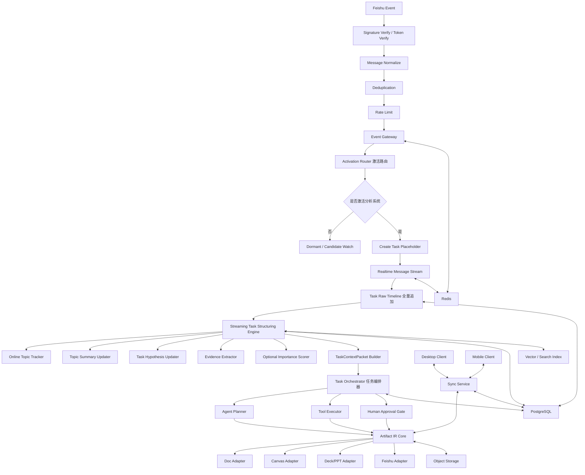
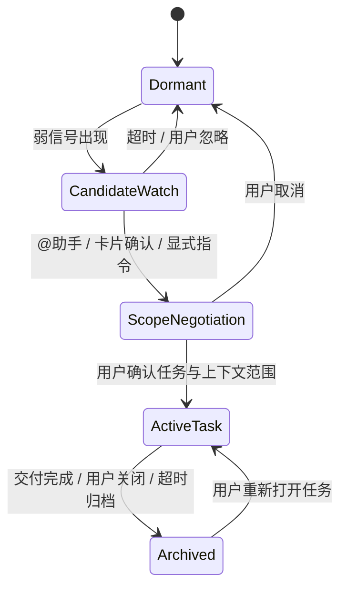
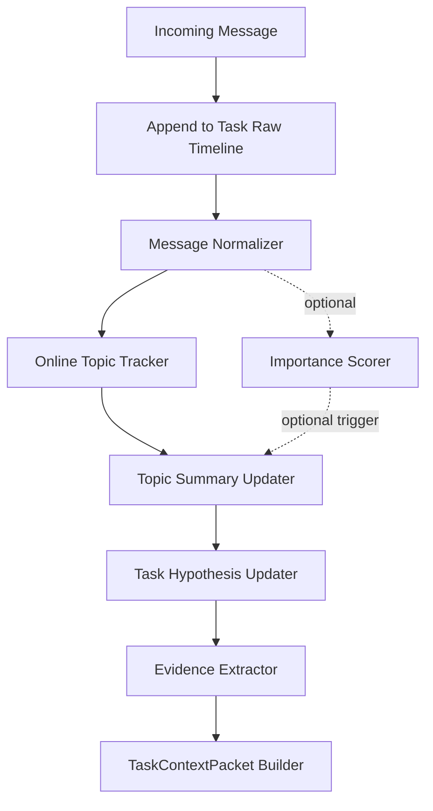

# 基于 IM 的办公协同智能助手 Agent 架构设计

> 版本：v0.2  
> 目标：作为研发初期的架构基线文档，指导后续产品、Agent、客户端、服务端与飞书集成开发。  
> 本版更新：在 v0.1 基础上补充 Streaming Task Structuring Engine，将 Importance Scorer 设为 optional，并明确“激活后所有消息进入 Task Raw Timeline，但不等于进入 Topic/Evidence/正式产物”。  
> 核心命题：从 IM 对话中捕捉需求，经过文档/白板沉淀、多方讨论、方案修改，最终形成正式演示稿或自由画布交付物。

---

## 1. 项目理解与设计结论

项目文档强调的不是“用户输入一句话，Agent 直接生成 PPT”，而是一个真实办公协作链路：需求常常从群聊或单聊中的自然讨论浮现，随后经历文档撰写、多方讨论、方案修改，最终沉淀为正式演示材料。

因此，本项目应被设计为一个 **Agent-Pilot 协同办公系统**，而不是简单的 IM Bot 或内容生成工具。

### 1.1 核心产品定义

本产品是一个以 AI Agent 为主驾驶、GUI 为仪表盘与辅助操作台的多端办公协同助手。它通过 IM 对话捕捉需求，通过 Agent 规划和工具调用驱动文档、白板、演示稿等办公套件，并在移动端与桌面端之间保持任务状态和内容产物的一致。

### 1.2 关键设计判断

1. Agent 不应默认全量监听并沉淀群聊内容。
2. 用户 @ 助手不是完整任务的起点，而是 Agent 进入协作上下文的激活点之一。
3. 系统核心对象不是 Prompt，而是 Collaboration Task，即协作任务实例。
4. 文档、白板、演示稿不是孤立产物，而是同一个任务实例下不同阶段的 Artifact Projection。
5. 多端一致性不应只同步 UI 状态，还要同步任务状态、产物状态、审批状态和上下文证据状态。
6. 所有进入正式文档和演示稿的事实都必须具备来源、置信度和确认状态。
7. 用户激活分析系统后，后续实时消息可以无条件进入该 Task 的 Raw Timeline，但必须经过结构化分层后，才可能进入 Topic、Evidence 或正式文档/PPT。

---

## 2. 总体架构图



### 设计原则

Event Gateway 不直接调用大模型，不直接生成文档，不直接保存所有聊天正文。它只做事件接入、标准化、去重、限流和路由。

---

## 3.2 Activation Router：Agent 激活路由

这是本项目最关键的模块之一，负责判断 Agent 何时应该进场、以什么范围进场、是否需要用户确认。

### 3.2.1 为什么需要激活路由

如果 Agent 默认持续吸收整个群聊，会带来两个严重问题：

1. 群聊中的闲聊、玩笑、碎片化表达会快速占满上下文窗口。
2. 低价值或无关信息会污染后续文档、白板和演示稿生成。

因此，系统必须将“监听事件”“摄入上下文”“写入任务记忆”三件事严格拆开。

```text
监听事件 ≠ 摄入上下文 ≠ 写入任务记忆 ≠ 写入正式文档
```

### 3.2.2 五级激活状态机



### 3.2.3 各状态说明

#### Dormant：休眠态

默认状态。Agent 不主动总结、不主动保存群聊正文、不创建任务。系统仅保留必要元数据，例如 chat_id、message_id、timestamp、sender_id、是否 @ 机器人、是否包含文档链接、是否为回复链。

#### CandidateWatch：候选观察态

当群内出现“整理方案”“下周评审”“出个 PPT”“形成文档”“谁来负责”等弱信号时，Agent 可以进入候选观察态，但不自动创建任务。

该状态只生成内部候选，不写入正式上下文。

#### ScopeNegotiation：范围协商态

当用户 @ 助手、点击任务卡片、回复某条消息要求整理，或手动选择消息片段后，系统进入范围协商态。

此时 Agent 会发送需求候选卡片，向用户确认：

- 是否创建任务
- 使用哪段聊天作为上下文
- 是否包含附件和文档
- 是否允许后续持续跟踪该话题

#### ActiveTask：任务运行态

用户确认后才创建协作任务实例。之后 Agent 只跟踪与该 task_id 相关的消息，并通过相关性闸门判断是否纳入任务上下文。

#### Archived：归档态

任务交付完成后关闭主动跟踪。后续群聊默认不再影响该任务，除非用户重新打开任务或显式要求更新。

### 3.2.4 激活触发类型

| 触发类型 | 示例 | 是否直接执行 |
|---|---|---|
| 显式命令 | `@助手，把刚才讨论整理成方案文档` | 进入范围协商，不直接最终生成 |
| 回复链触发 | 回复某条消息：`@助手，从这串讨论生成方案` | 以回复链为优先上下文 |
| 卡片按钮触发 | 点击“创建协作任务” | 进入任务创建 |
| 手动选择消息 | 用户框选多条消息并创建任务 | 以选中消息为上下文 |
| 弱主动建议 | Agent 检测到高置信需求候选 | 只发建议卡片，不越权执行 |

---

## 3.3 Context Hygiene Manager：上下文卫生系统

> 本节为 v0.2 重点修订。  
> 结论：用户激活分析系统后，消息可以无条件进入该 Task 的 Raw Timeline；但 Raw Timeline 只是原材料层，不等于消息可以无条件进入 Topic、Evidence、Doc/PPT 生成上下文。Importance Scorer 仅作为 optional 优化模块，不作为 MVP 必需链路。

### 3.3.1 核心分层：Raw Timeline、Topic Tree、Evidence、Artifact Context

系统必须区分四层数据：

```text
Task Raw Timeline
  所有激活后的实时消息都进入这里，作为任务原始时间线。
  这一层强调“完整记录”，不强调“可直接生成”。

Task Topic Tree
  将 Raw Timeline 中有讨论结构价值的消息组织成主题树。
  这一层强调“归类、摘要、演化”。

Evidence Set
  从 Topic Tree 中抽取可作为事实、决策、约束、风险、行动项的证据。
  这一层强调“可追溯、可引用、可确认”。

Artifact Context
  Agent 生成文档、白板、PPT 时真正可用的上下文。
  这一层强调“高置信、来源明确、可进入交付物”。
```

因此，激活后数据流不是：

```text
实时消息 → Agent → 文档
```

而是：

```text
实时消息
  ↓
Task Raw Timeline
  ↓
Streaming Task Structuring Engine
  ↓
Task Topic Tree
  ↓
Evidence Set / Open Questions / Task Brief
  ↓
TaskContextPacket
  ↓
Agent Planner / Artifact Generator
```

### 3.3.2 Streaming Task Structuring Engine：实时任务结构化引擎

这是上下文卫生系统的核心子模块，负责把实时 IM 消息流转成可供 Agent 使用的结构化任务树。



#### 模块职责

| 子模块 | 是否必需 | 职责 |
|---|---:|---|
| Message Normalizer | 必需 | 将飞书消息转为统一 MessageRecord |
| Task Raw Timeline | 必需 | 保存激活后所有实时消息 |
| Online Topic Tracker | 必需 | 将消息挂到已有 topic 或创建新 topic |
| Topic Summary Updater | 必需 | 以 micro-batch 或事件触发方式增量更新 topic 摘要 |
| Task Hypothesis Updater | 必需 | 动态推断 task title、goal、deliverables、deadline |
| Evidence Extractor | 必需 | 从 topic 中抽取事实、决策、风险、约束、待办 |
| Importance Scorer | 可选 | 用于加速高价值消息即时更新，但不是核心依赖 |

### 3.3.3 激活后 Task 占位符

用户通过 @、卡片按钮、快捷指令或手动选择消息激活分析系统后，系统立即创建 Task 占位符。

```json
{
  "task_id": "task_001",
  "status": "collecting",
  "title": null,
  "goal": null,
  "deliverables": [],
  "task_summary": null,
  "source_chat_id": "chat_001",
  "raw_timeline_enabled": true,
  "created_from_activation": true
}
```

此时系统只知道“用户希望从这里开始分析”，但不一定知道任务具体是什么。因此 Task 允许处于 `collecting / topic_unknown` 状态。

### 3.3.4 消息进入规则：全量进入 Raw Timeline，分层进入后续上下文

激活后，实时消息处理规则如下：

| 层级 | 是否全量进入 | 说明 |
|---|---:|---|
| Task Raw Timeline | 是 | 用户激活后，后续消息都作为任务原材料保存 |
| Topic Tree | 否 | 只有能归入讨论主题或创建新主题的消息进入 |
| Evidence Set | 否 | 只有可形成事实、决策、风险、约束、行动项的消息进入 |
| Artifact Context | 否 | 只有高置信或用户确认的信息进入正式生成上下文 |

这解决两个问题：

1. 用户主动激活后，系统不会遗漏后续消息。
2. 闲聊或低价值消息不会直接污染文档/PPT。

### 3.3.5 MessageRecord：统一消息结构

```json
{
  "message_id": "msg_001",
  "task_id": "task_001",
  "chat_id": "chat_001",
  "sender_id": "user_a",
  "sender_name": "A",
  "timestamp": "2026-05-04T18:40:00+08:00",
  "content_type": "text",
  "normalized_text": "客户说 onboarding 太慢",
  "raw_payload_ref": "s3://raw-events/msg_001.json",
  "source_platform": "feishu",
  "is_activation_after": true
}
```

Raw payload 可以短期存储，规范化后的文本和必要元数据进入 PostgreSQL。

### 3.3.6 Online Topic Tracker：实时话题归类

每条消息进入 Raw Timeline 后，系统尝试将其归入已有 topic，或创建新 topic。

#### 基础策略

```text
1. 对消息生成 embedding。
2. 与当前 Task 下已有 topic 的 centroid_embedding 比较。
3. 如果相似度高，归入已有 topic。
4. 如果相似度低但内容有结构价值，创建新 topic。
5. 如果无法判断，进入 pending_uncertain 或 misc topic。
```

#### Topic Assignment 规则

```text
最高相似度 >= topic_attach_threshold
  → 归入已有 topic

最高相似度 < topic_attach_threshold 且消息具备新主题信号
  → 创建新 topic

最高相似度不明确，多个 topic 分数接近
  → pending_uncertain，等待 micro-batch 处理

明显闲聊或无结构价值
  → 保留在 Raw Timeline，不进入 Topic Tree
```

注意：本层不再做“消息与 Task 是否相关”的强过滤，因为激活已经表达了用户意愿。MVP 阶段可以省略 task relevance 判断，只保留 `misc / pending_uncertain` 兜底。

### 3.3.7 TopicNode：任务话题树节点

```json
{
  "topic_id": "topic_cause",
  "task_id": "task_001",
  "parent_topic_id": null,
  "title": "可能原因",
  "type": "cause",
  "summary": "权限配置和模板选择可能是 onboarding 流程的主要卡点。",
  "message_ids": ["msg_002", "msg_003"],
  "evidence_ids": ["ev_002", "ev_003"],
  "centroid_embedding": [0.012, 0.089],
  "status": "active",
  "confidence": 0.81,
  "last_updated_at": "2026-05-04T18:42:00+08:00"
}
```

Topic Tree 不只是后端结构，也可以直接投影到前端，形成类似会议纪要的树状讨论记录。用户后续选择 scope 时，可以按 topic 选择，而不仅仅按时间窗口选择。

### 3.3.8 Topic Summary Updater：增量摘要更新

Topic 摘要不应该每条消息都全文重写，而应采用增量更新。

#### 推荐更新策略

| 策略 | 说明 |
|---|---|
| Micro-batch | 普通消息每 30 秒或每 N 条消息聚合更新一次 |
| Rule-triggered | 出现交付物、deadline、决策、风险等信号时立即更新 |
| Manual flush | 用户点击“总结当前讨论”时立即更新 |
| Importance-triggered | 可选，如果启用 Importance Scorer，高分消息立即更新 |

MVP 可以不实现 Importance Scorer，采用：

```text
普通消息：30 秒 micro-batch 更新 topic summary
强规则消息：立即更新 topic summary 和 task hypothesis
```

#### 增量摘要输入

```json
{
  "topic_id": "topic_cause",
  "old_summary": "权限配置可能是 onboarding 流程卡点。",
  "new_messages": [
    {
      "message_id": "msg_003",
      "sender": "C",
      "text": "我记得模板选择也卡"
    }
  ],
  "update_mode": "micro_batch"
}
```

#### 增量摘要输出

```json
{
  "new_summary": "权限配置和模板选择可能是 onboarding 流程的主要卡点。",
  "summary_patch_reason": "新增了模板选择这一可能原因",
  "new_evidence_candidates": [
    {
      "claim": "模板选择也可能是 onboarding 流程卡点",
      "source_message_id": "msg_003",
      "type": "cause",
      "confidence": 0.78
    }
  ],
  "open_questions": []
}
```

### 3.3.9 Task Hypothesis Updater：动态任务推断

Task 一开始可以没有明确标题。随着消息流进入，系统动态更新任务假设。

#### 示例

实时消息：

```text
A：客户说 onboarding 太慢
B：是不是权限配置那块？
C：我记得模板选择也卡
D：不是所有客户都这样，大客户更明显
E：下周老板要看优化方案
F：我觉得可以将模块 a...
```

任务演化：

```text
阶段 1：客户 onboarding 问题
阶段 2：客户 onboarding 流程卡点分析
阶段 3：客户 onboarding 流程优化方案
阶段 4：面向老板评审的客户 onboarding 优化方案
```

当首次识别到交付物请求，如“下周老板要看优化方案”“出一份方案”“生成 PPT”，系统将 Task 状态从 `collecting` 推进到 `deliverable_identified`。

```json
{
  "task_id": "task_001",
  "status": "deliverable_identified",
  "title": "客户 onboarding 流程优化方案",
  "goal": "形成面向老板评审的 onboarding 优化方案",
  "deliverables": ["方案文档", "评审演示稿"],
  "deadline": "下周",
  "task_summary": "团队正在讨论客户 onboarding 流程较慢的问题，初步原因包括权限配置和模板选择，大客户场景更明显，并需要在下周形成老板评审方案。",
  "confidence": 0.88
}
```

### 3.3.10 Importance Scorer：可选增强模块

Importance Scorer 不作为 MVP 必需模块。系统不依赖它来完成基础任务结构化。

#### 不启用 Importance Scorer 时

```text
所有消息进入 Raw Timeline
  ↓
按 embedding 归入 topic 或 pending/misc
  ↓
普通消息 micro-batch 更新
  ↓
命中强规则时立即更新
```

#### 启用 Importance Scorer 时

Importance Scorer 可提升系统实时性，让高价值消息绕过 micro-batch 立即触发摘要和任务假设更新。

可选信号包括：

```text
交付物信号：方案、文档、PPT、汇报、老板要看
时间信号：今天、明天、下周、月底、评审前
决策信号：就这么定、先按这个、方案二更好
行动项信号：我来负责、你去补、谁来整理
证据信号：平均、百分比、客户数量、数据指标
风险信号：风险、阻塞、不确定、依赖
争议信号：我不同意、不一定、不是所有客户
```

#### 可选实现

```text
Level 1：规则打分
Level 2：轻量文本分类模型
Level 3：小模型 reranker
Level 4：大模型兜底
```

推荐 MVP 使用 Level 1 规则打分即可，甚至可以完全不启用 Importance Scorer。

### 3.3.11 Evidence Extractor：证据抽取

Evidence Extractor 不直接处理整个群聊，而是从 Topic Summary 和关联消息中抽取可追溯证据。

```json
{
  "evidence_id": "ev_001",
  "task_id": "task_001",
  "topic_id": "topic_problem",
  "source_type": "feishu_message",
  "source_message_id": "msg_001",
  "claim": "客户反馈 onboarding 流程较慢",
  "evidence_type": "problem",
  "status": "candidate",
  "confidence": 0.86
}
```

证据状态：

```text
candidate：候选证据
accepted：用户确认或高置信事实
rejected：用户驳回
deprecated：被后续消息推翻或替代
```

### 3.3.12 TaskContextPacket：传给 Agent 的正式输入

上下文卫生系统最终不把原始聊天流交给 Agent，而是交付结构化输入。

```json
{
  "task_brief": {
    "task_id": "task_001",
    "title": "客户 onboarding 流程优化方案",
    "goal": "形成面向老板评审的 onboarding 优化方案",
    "deliverables": ["方案文档", "评审演示稿"],
    "deadline": "下周"
  },
  "topic_tree": [
    {
      "title": "问题现象",
      "summary": "客户反馈 onboarding 流程较慢。",
      "evidence_ids": ["ev_001"]
    },
    {
      "title": "可能原因",
      "summary": "权限配置和模板选择可能是主要卡点。",
      "evidence_ids": ["ev_002", "ev_003"]
    },
    {
      "title": "影响范围",
      "summary": "大客户场景更明显。",
      "evidence_ids": ["ev_004"]
    },
    {
      "title": "交付要求",
      "summary": "下周需要向老板展示优化方案。",
      "evidence_ids": ["ev_005"]
    }
  ],
  "evidence_set": [],
  "open_questions": [
    "是否有 onboarding 耗时数据？",
    "大客户与普通客户的差异是否有量化指标？"
  ],
  "artifact_context_policy": {
    "allow_candidate_evidence": false,
    "require_source_refs": true
  }
}
```

Agent Planner 基于 TaskContextPacket 做意图识别、计划生成和工具调用，而不是基于原始群聊全文。

### 3.3.13 正式文档写入规则

正式文档只能使用以下信息：

- 用户显式确认的信息
- Accepted Evidence 中的信息
- 高置信候选信息，但必须标注“待确认”
- Agent 自行推理出的内容，但必须标注为“建议”或“推测”

严禁将闲聊、玩笑、未确认猜测、无来源信息写成确定事实。


## 3.4 Task Orchestrator：任务编排器

Task Orchestrator 是 Agent 工作流的控制中心，负责把一个协作任务从需求捕捉推进到交付归档。它的输入不应是原始聊天流，而应是 Context Hygiene Manager 输出的 TaskContextPacket，包括 TaskBrief、TopicTree、EvidenceSet、OpenQuestions 和 ArtifactContextPolicy。

### 任务生命周期


### Agent 工作流节点

| 节点 | 职责 |
|---|---|
| Intent Router | 判断用户意图：总结、创建任务、修改文档、生成演示稿、查询进度等 |
| Context Builder | 构建任务范围内的上下文 |
| Brief Generator | 生成任务简报 |
| Planner | 拆解任务步骤 |
| Tool Selector | 选择飞书、文档、画布、PPT、搜索等工具 |
| Executor | 执行工具调用 |
| Reviewer | 检查输出质量和风险 |
| Approval Gate | 对写操作、发布操作、人群可见操作请求确认 |
| Delivery Manager | 导出、分享、归档、回写 IM |

### 可恢复执行

Agent 工作流必须具备持久化状态，避免长任务中断后丢失上下文。LangGraph 的 durable execution 能保存每个执行步骤状态，使流程在失败或延迟后恢复；Human-in-the-Loop 能在关键工具调用前暂停，等待用户审核或批准。

---

## 3.5 Artifact IR Core：产物中间表示层

系统不应直接把飞书文档或 PPT 文件作为唯一真相源，而应在内部维护统一的 Artifact IR。

### 3.5.1 为什么需要 Artifact IR

如果 Agent 直接操作飞书文档、PPT 文件或画布 DOM，会导致：

1. 多端同步困难。
2. 版本回滚困难。
3. 后续接入其他平台成本高。
4. Agent 修改难以审计。
5. 文档、画布、演示稿之间无法复用结构。

因此需要内部统一表示：

```text
Task Brief
  ↓
Doc IR
  ↓
Canvas IR
  ↓
Deck IR
  ↓
External Projection：飞书文档 / PPTX / PDF / 自由画布
```

### 3.5.2 Doc IR

```json
{
  "artifact_id": "doc_001",
  "type": "doc",
  "title": "客户 onboarding 优化方案",
  "sections": [
    {
      "id": "sec_background",
      "title": "背景",
      "blocks": [],
      "source_refs": ["msg_001", "doc_003"]
    }
  ],
  "version": 3
}
```

### 3.5.3 Canvas IR

```json
{
  "artifact_id": "canvas_001",
  "type": "canvas",
  "nodes": [
    { "id": "node_1", "type": "text", "text": "当前流程痛点" },
    { "id": "node_2", "type": "diagram", "diagram_type": "flow" }
  ],
  "edges": [
    { "from": "node_1", "to": "node_2", "type": "supports" }
  ]
}
```

### 3.5.4 Deck IR

```json
{
  "artifact_id": "deck_001",
  "type": "deck",
  "slides": [
    {
      "id": "slide_1",
      "title": "问题背景",
      "layout": "title_content",
      "blocks": [],
      "speaker_notes": "强调客户反馈与业务影响"
    }
  ]
}
```

---

## 3.6 多端协同与同步架构

项目必须支持移动端与桌面端状态和数据实时同步。这里需要区分三类状态。

### 3.6.1 状态分类

| 状态类型 | 示例 | 同步策略 |
|---|---|---|
| 工作流状态 | 任务进度、审批状态、执行节点 | 服务端权威、事件溯源、乐观锁 |
| 产物编辑状态 | 文档正文、画布节点、演示稿结构 | CRDT / patch / 版本快照 |
| UI 临时状态 | 当前展开面板、光标位置、选中元素 | 本地状态或 presence 同步 |

### 3.6.2 推荐同步策略

1. 工作流状态由服务端权威管理。
2. 文档/画布编辑状态使用 Yjs 等 CRDT 机制支持多人协作和离线合并。
3. 关键产物定期生成 Snapshot，方便回滚和审计。
4. 移动端以确认、查看、轻编辑为主；桌面端以深度编辑、画布布局、演示稿调整为主。

Yjs 是用于构建协作应用的高性能 CRDT，支持共享数据类型并自动合并并发修改，适合文档和画布类协同编辑场景。

---

## 4. 飞书集成设计

## 4.1 接入方式

| 能力 | 飞书能力 | 用途 |
|---|---|---|
| IM 入口 | 接收消息事件 | 接收群聊/单聊触发 |
| 交互确认 | 飞书卡片交互 | 创建任务、确认范围、审批发布 |
| 文档创建 | docx 文档创建 API | 创建方案文档 |
| 文档编辑 | Block 创建/更新 API | 结构化写入文档内容 |
| 文档导出 | 云文档导出任务 | 导出 PDF、Word 等交付文件 |
| MCP | 远程 MCP 工具 | 可作为云文档工具加速层 |

### 4.2 设计注意事项

飞书远程 MCP 当前官方说明为主要支持云文档场景，工具仍在扩展中。因此本系统不能完全依赖 MCP，应采用 OpenAPI 直连为主、MCP 为辅的方式。

### 4.3 消息卡片设计

#### 需求候选卡片

```text
我发现这段讨论可能形成一个协作任务：

主题：客户 onboarding 优化方案
可能目标：整理现状问题，并形成下周评审材料
上下文范围建议：本回复链 + 最近 30 分钟相关消息

[创建任务] [只总结本轮讨论] [忽略] [不要再提醒此话题]
```

#### 任务进度卡片

```text
任务：客户 onboarding 优化方案
状态：文档初稿已生成，等待补充数据
当前产物：方案文档 v1.2
下一步：生成评审演示稿

[打开文档] [补充信息] [生成演示稿] [关闭任务]
```

#### 审批卡片

```text
Agent 准备将以下内容写入正式文档：

新增事实：权限配置平均耗时约 2 天
来源：张三 10:12 群聊消息
影响章节：2.1 当前问题

[批准写入] [修改后写入] [拒绝]
```

---

## 5. 客户端设计

## 5.1 推荐技术路线

首版推荐使用：

```text
Tauri 2 + React + TypeScript
```

理由：Tauri 2 支持从单一代码库构建 Linux、macOS、Windows、Android、iOS 应用，且前端框架无关；这适合本项目的桌面端和移动端统一研发。若未来强移动体验优先，可考虑 Flutter 重构移动壳层，但初期不建议拆成多套客户端。

## 5.2 桌面端定位

桌面端是生产主场，重点能力：

- 任务驾驶舱
- 文档深度编辑
- 白板/自由画布编辑
- 演示稿结构调整
- Agent 执行轨迹查看
- 多版本对比

## 5.3 移动端定位

移动端是触发与确认主场，重点能力：

- IM 触发任务
- 查看任务进度
- 语音补充信息
- 审批 Agent 写入/发布动作
- 快速查看文档和演示稿
- 轻量改稿

---

## 6. Agent 工具权限与安全设计

## 6.1 工具分级

| 等级 | 工具类型 | 示例 | 是否需要确认 |
|---|---|---|---|
| L1 Read | 读取消息、读取文档、搜索资料 | 低风险 | 默认允许，受权限限制 |
| L2 Draft | 生成草稿、生成建议 | 中低风险 | 不需要发布确认 |
| L3 Write | 写入文档、更新画布、修改演示稿 | 中风险 | 重要内容需要确认 |
| L4 Publish | 群发消息、分享链接、导出正式文件 | 高风险 | 必须确认 |
| L5 Admin | 权限变更、删除文件、外部发送 | 最高风险 | 首版不开放或强审批 |

## 6.2 Human Approval Gate

所有对外可见、不可逆或影响多人协作的动作都要经过审批。例如：

- 向群里发布总结
- 修改正式文档关键章节
- 导出演示稿并发送给群成员
- 将候选信息标记为正式事实
- 归档任务

Human-in-the-Loop 机制应作为工作流节点，而不是临时弹窗。

---

## 7. 数据模型设计

## 7.1 核心实体

```text
User
Workspace
Chat
MessageEvent
RawMessage
ActivationCandidate
Task
TaskScope
TaskBrief
TaskHypothesis
TopicNode
TopicMessageLink
TopicSummaryVersion
Evidence
OpenQuestion
Plan
PlanStep
ToolCall
Approval
Artifact
ArtifactVersion
ArtifactPatch
ExternalBinding
DeliveryRecord
AuditLog
```

## 7.2 Task

```json
{
  "id": "task_001",
  "workspace_id": "ws_001",
  "source_chat_id": "chat_001",
  "anchor_message_id": "msg_001",
  "title": "客户 onboarding 优化方案",
  "status": "active",
  "owner_id": "user_001",
  "created_at": "2026-05-04T10:00:00+08:00",
  "updated_at": "2026-05-04T11:00:00+08:00"
}
```

## 7.3 TaskScope

```json
{
  "task_id": "task_001",
  "capture_mode": "reply_thread_and_semantic_window",
  "time_window_before_minutes": 45,
  "time_window_after_minutes": 20,
  "selected_message_ids": ["msg_001", "msg_002"],
  "topic_keywords": ["onboarding", "权限配置", "客户反馈"],
  "participants": ["user_a", "user_b"]
}
```

## 7.4 Evidence

```json
{
  "id": "evidence_001",
  "task_id": "task_001",
  "source_type": "feishu_message",
  "source_id": "msg_001",
  "claim": "权限配置平均耗时约 2 天",
  "confidence": 0.86,
  "status": "accepted",
  "accepted_by": "user_001"
}
```

## 7.5 TopicNode

```json
{
  "id": "topic_cause",
  "task_id": "task_001",
  "parent_topic_id": null,
  "title": "可能原因",
  "type": "cause",
  "summary": "权限配置和模板选择可能是 onboarding 流程的主要卡点。",
  "centroid_embedding": [0.012, 0.089],
  "confidence": 0.81,
  "status": "active",
  "last_updated_at": "2026-05-04T18:42:00+08:00"
}
```

## 7.6 TopicMessageLink

```json
{
  "topic_id": "topic_cause",
  "message_id": "msg_002",
  "task_id": "task_001",
  "role": "cause_candidate",
  "similarity_score": 0.78,
  "created_at": "2026-05-04T18:41:00+08:00"
}
```

## 7.7 TopicSummaryVersion

```json
{
  "id": "sumver_001",
  "topic_id": "topic_cause",
  "task_id": "task_001",
  "summary_text": "权限配置和模板选择可能是 onboarding 流程的主要卡点。",
  "source_message_ids": ["msg_002", "msg_003"],
  "update_mode": "micro_batch",
  "created_at": "2026-05-04T18:42:00+08:00"
}
```

## 7.8 TaskContextPacket

TaskContextPacket 可以不作为独立表长期存储，也可以作为任务每次进入 Agent Planner 前的快照保存。

```json
{
  "task_id": "task_001",
  "task_brief_ref": "brief_001",
  "topic_tree_snapshot_id": "topic_snapshot_001",
  "evidence_snapshot_id": "evidence_snapshot_001",
  "artifact_context_policy": {
    "require_source_refs": true,
    "allow_candidate_evidence": false
  }
}
```

## 7.9 ArtifactPatch

```json
{
  "id": "patch_001",
  "artifact_id": "doc_001",
  "operation": "update_section",
  "target_path": "sections.2.blocks.1",
  "reason": "新增权限配置耗时数据",
  "source_evidence_ids": ["evidence_001"],
  "status": "pending_approval"
}
```

---

## 8. 技术选型建议

| 层级 | 推荐技术 | 说明 |
|---|---|---|
| 客户端 | Tauri 2 + React + TypeScript | 多端统一代码库，桌面与移动端共用核心 UI |
| 状态管理 | Zustand / Redux Toolkit | 前端状态管理 |
| 文档编辑 | Tiptap / ProseMirror + Yjs | 富文本与协同编辑 |
| 画布 | tldraw | 自由画布、结构图、流程图 |
| PPT 生成 | PptxGenJS | JS 侧生成 PPTX |
| 服务端 | Python FastAPI | API 与 Agent 服务 |
| Agent 编排 | LangGraph | 可恢复、有状态、Human-in-the-Loop |
| 数据库 | PostgreSQL | 任务、版本、审计、映射关系 |
| 缓存/队列 | Redis | 事件去重、短期缓存、任务队列 |
| 对象存储 | S3-compatible Storage | 附件、导出文件、快照 |
| 检索 | pgvector / Elasticsearch / OpenSearch | 任务知识检索和上下文召回 |
| 飞书集成 | OpenAPI + 卡片 + 事件订阅 | IM、Doc、导出、审批交互 |

PptxGenJS 支持在 Node、React、Web Browser 等环境生成 PowerPoint，并支持文本、表格、形状、图片、图表等对象，适合作为首版演示稿导出方案。

---

## 9. 端到端主流程

```mermaid
sequenceDiagram
    participant U as 用户/群聊
    participant F as 飞书 IM
    participant G as Event Gateway
    participant A as Activation Router
    participant S as Streaming Task Structuring
    participant C as Context Hygiene
    participant T as Task Orchestrator
    participant L as Agent Planner
    participant D as Doc/Canvas/Deck IR
    participant P as 多端客户端

    U->>F: 激活分析系统 / @助手 / 点击卡片
    F->>G: 推送激活事件
    G->>A: 标准化事件
    A->>S: 创建 Task 占位符
    U->>F: 后续实时消息流
    F->>G: 持续推送接收消息事件
    G->>S: 追加到 Task Raw Timeline
    S->>S: Topic Assignment / Micro-batch Summary
    S->>S: 动态更新 Task Hypothesis
    S->>C: 输出 TopicTree / Evidence / OpenQuestions
    C->>T: 输出 TaskContextPacket
    T->>L: 生成执行计划
    L->>T: 返回 PlanGraph
    T->>D: 生成 Doc IR
    D->>P: 同步桌面/移动端
    U->>P: 审阅和修改
    T->>D: 生成 Deck IR / Canvas IR
    D->>F: 导出链接或文件回写群聊
```text
飞书 IM 入口
  → 需求候选识别
  → 用户确认上下文范围
  → 创建协作任务
  → 生成 Task Brief
  → 生成方案文档
  → 多端同步查看与审批
  → 生成自由画布或 PPTX
  → 导出/分享/归档
```

### MVP 必须完成

1. 飞书 IM 文本入口。
2. 飞书消息卡片确认任务。
3. Activation Router 状态机。
4. Task Scope 上下文边界。
5. Context Hygiene 三层上下文。
6. Streaming Task Structuring Engine：Raw Timeline、Topic Tree、Topic Summary、Task Hypothesis。
7. TaskContextPacket 输出给 Agent Planner。
8. Agent Planner 生成任务计划。
9. 文档初稿生成。
10. 桌面端与移动端任务状态同步。
11. PPTX 或自由画布至少一种交付形态。
12. 交付结果回写 IM。

### MVP 可暂缓

1. 完整离线编辑。
2. 高级视觉排版。
3. 多租户复杂权限。
4. 全量知识库 RAG。
5. 自动主动监听所有群。
6. 多 Agent 复杂协商。

---

## 11. 风险与应对

| 风险 | 表现 | 应对策略 |
|---|---|---|
| 上下文污染 | 闲聊进入文档 | Activation Router + Raw Timeline 分层 + Topic Tree + Evidence 分层 |
| Agent 越权 | 未确认就写文档或发群消息 | Human Approval Gate |
| 长任务中断 | 任务执行一半失败 | Durable Workflow + Checkpoint |
| 多端冲突 | 手机和桌面同时编辑 | CRDT + Snapshot + Patch 审计 |
| 外部平台限制 | 飞书 API 权限、频率、能力边界 | Adapter 封装 + 降级方案 |
| 生成内容不可追溯 | 文档结论来源不明 | source_refs + Evidence Store |
| 工程复杂度过高 | 首版无法交付 | MVP 聚焦 IM → Doc → Deck/Canvas 闭环 |

---

## 12. 推荐研发里程碑

### Phase 1：基础闭环

- 飞书机器人接入
- 消息事件接收
- 卡片交互
- 显式 @ 触发
- 创建任务
- 生成 Task Brief
- 生成文档初稿

### Phase 2：上下文治理与实时结构化

- Activation Router 状态机
- Task Raw Timeline
- Streaming Task Structuring Engine
- Online Topic Tracker
- Topic Summary Updater
- Task Hypothesis Updater
- Evidence Store
- TaskContextPacket Builder
- 文档 patch 更新

### Phase 3：多端协同

- 桌面端任务驾驶舱
- 移动端任务确认页
- WebSocket 同步
- 文档/画布状态同步

### Phase 4：演示稿/自由画布

- Doc IR → Deck IR
- PPTX 导出
- 自由画布视图
- 演讲稿和排练问答

### Phase 5：工业化增强

- 离线编辑与合并
- 更完整审计日志
- 企业权限模型
- 多平台 Adapter
- 质量评测与回归测试

---

## 13. 架构决策记录 ADR

### ADR-001：Agent 默认不全量摄入群聊正文

决策：系统只进行事件级感知，只有显式激活或用户确认后才摄入有限上下文。

原因：避免闲聊和低密度信息污染任务上下文。

### ADR-002：以 Collaboration Task 作为系统核心对象

决策：Prompt 不是核心对象，Task 才是核心对象。

原因：办公协作具有持续性、多人参与、状态变化和产物演化。

### ADR-003：采用 Artifact IR，而非直接绑定飞书文档/PPT

决策：内部维护 Doc IR、Canvas IR、Deck IR，并通过 Adapter 投影到外部平台。

原因：便于版本管理、多端同步、跨平台扩展和 Agent 审计。

### ADR-004：工作流状态服务端权威，编辑状态支持 CRDT

决策：任务状态由服务端管理，文档/画布编辑状态采用 CRDT 或 patch-based 协同。

原因：工作流需要强一致审计，内容编辑需要多人并发与离线合并。

### ADR-005：高风险工具调用必须 Human-in-the-Loop

决策：写文档关键段落、发布群消息、导出正式文件、归档任务等操作必须可确认、可拒绝、可修改。

原因：办公场景容错率低，Agent 不能越权代替用户做公开发布动作。

---

### ADR-006：激活后消息全量进入 Task Raw Timeline

决策：用户主动激活分析系统后，后续实时消息全部进入该 Task 的 Raw Timeline。

原因：激活行为表达了用户希望系统从此处开始跟踪上下文，系统不应在原材料层过早丢弃消息。

边界：Raw Timeline 不是生成上下文。消息仍需经过 Topic Tree、Evidence、Artifact Context 分层后才能进入正式产物。

### ADR-007：Importance Scorer 作为 optional 模块

决策：Importance Scorer 不作为 MVP 必需模块。基础系统依靠 micro-batch、规则触发、embedding topic assignment 完成实时结构化。

原因：重要性分类可以提升实时性，但不是架构正确性的必要条件。MVP 中将其设为 optional 可降低工程复杂度。

### ADR-008：Agent 不直接消费实时聊天流

决策：Agent Planner 的输入是 TaskContextPacket，而不是 Raw Timeline。

原因：降低上下文污染风险，使文档/PPT 生成具备来源追踪和稳定结构。


## 14. 参考依据

- 项目文档：《基于 IM 的办公协同智能助手（公开版）》
- 飞书开放平台：事件订阅、接收消息事件、消息卡片交互、云文档 OpenAPI、文档块 API、导出任务 API、远程 MCP 工具列表
- 飞书官方 lark-cli：覆盖消息、文档、多维表格、电子表格、幻灯片、日历、邮箱、任务、会议、Markdown 等业务域，适合作为飞书操作工具层，但不替代本系统的实时对话结构化层
- LangGraph 官方文档：durable execution、human-in-the-loop、stateful agent workflow、persistence/checkpoint、short-term memory
- Yjs 官方文档：CRDT、共享数据类型、协同编辑与同步
- Tauri 2 官方文档：跨桌面与移动端的单代码库应用框架
- PptxGenJS 官方文档：基于 JavaScript 生成 PowerPoint 文件
- pgvector：PostgreSQL 内向量相似度搜索扩展，可在 MVP 阶段与业务数据共库保存向量索引

---

## 15. 一句话总结

本项目的正确架构不是“IM Bot + 文档生成器”，而是一个以协作任务为中心、以 Agent 工作流为主驾驶、以受控上下文和证据链为基础、以多端同步和 Artifact IR 为支撑的办公协同 Agent 系统。
